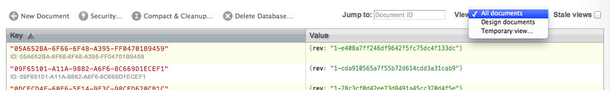
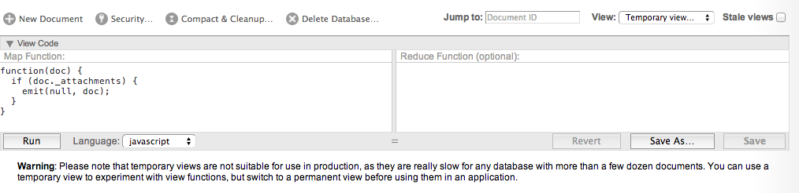
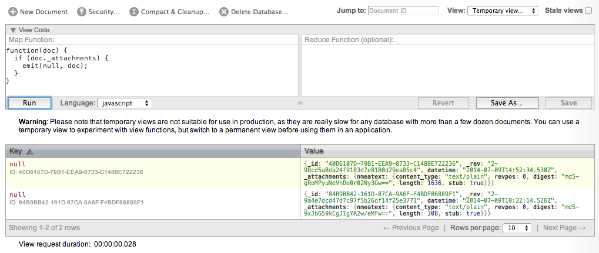

## Geo-Blueotooth

This is a project to test reading GPS data from a Garmin GLO or Bad Elf Pro via Bluetooth. It uses Don Coleman's [BluetoothSerial plugin for PhoneGap/Cordova](https://github.com/don/BluetoothSerial).


### To install the project:

* Clone this repo

 $ git clone https://github.com/tigoe/geo-bluetooth

* change directories to the repo:

	$ cd geo-bluetooth
	
* Add the Android platform:

	$ cordova platform add android

* AND/OR add the iOS plaform 

	$ cordova platform add ios

* Add the Bluetooth plugin:

	$ cordova plugin add com.megster.cordova.bluetoothserial

* Plug in your android device, then compile and run:

	$ cordova run

_**iOS Note:** The iOS status bar overlaps the phonegap app in an ugly way. It's not crucial,  but if you like, you can fix  by changing a few lines of iOS code. In your phonegap project, open the file /platforms/ios/geo-bluetooth/Classes/MainViewController.m and copy and paste the code described here: http://stackoverflow.com/a/19249775/225134_

### To set up CouchDB for use with the app.

* Connect your mobile device and your computer to the same Wi-Fi network.

* Download and install CouchDB for OSX as described in <http://docs.couchdb.org/en/latest/install/mac.html#installation-using-the-apache-couchdb-native-application>

* Confirm that Couch is running by visiting localhost:5984/_utils (or *127.0.0.1* instead of *localhost*) in a browser. This is the GUI interface for CouchDB, called *Futon*.

* [UPDATE! optional. Couch will create a new database in the sync process if it does not exist.] In Futon, choose "Create New Database" and call the new database whatever you like. 

* In OSX System Preferences > Network, find your IP address. It will say something like, *"Wi-Fi is connected to MyAwesomeNetwork and has the IP address 192.168.1.2"*

* Test that the IP address works on your Android & that CouchDB is available. In the browser on your mobile device, type your IP and add the port number, eg., 192.168.1.3:5984. If it works, you'll see a short JSON string, like: 

	{"couchdb":"Welcome","uuid":"fec59fb0d1263eb47eea6c05b472c14c","version":"1.5.1","vendor":{"version":"1.5.1","name":"The Apache Software Foundation"}}

* In the geo-bluetooth application, under "Configure CouchDB", set the *Server URL* to http://YOUR_IP_ADDRESS:5984/ as above and *Database Name* to the name of the CouchDB database you just created.


### Using the app

#### Once you have the app running, here's how to capture data:

* Make sure Bluetooth is turned on, and that you are paired with your Garmin GLO or Bad Elf Pro
* Click Scan to scan for available Bluetooth GPS devices, and then pick yours from the options menu.
* Set the storage frequency in the app. This will set how frequently the app stores a NMEA record. The default is 30 seconds if you don't set it.
* Click Connect to start the connection to your GPS device. You should see data coming in the NMEA log of the app.
* To stop capturing data, click Disconnect.
* The app will continue logging data in the background until you click Disconnect, or Save to Couch

#### To upload data: 
* Set up CouchDB on your laptop as described above, and configure CouchDB as described above.
* After a few minutes or a whole day in the field, click Save to Couch. This will automatically disconnect from your Bluetooth GPS app and stop logging. After a few seconds, you should get a message saying "Successfully saved to CouchDB". 
* If you get an error, check that you have CouchDB running, that your device is on the same local area network as your laptop, and that you have the network address correct as described above.


### Reading the data in CouchDB:

The majority of records in  CouchDB will be parsed NMEA sentences, one for every 30 seconds (assuming the default) that you logged. If you want to see the raw NMEA log record, choose "Temporary View" from the View menu in Couch:



 This will bring you a search box where you can run a query on the database:
 


Type the following into the "Map Function" box and then click Run:

```javascript
function(doc) {
  if (doc._attachments) {
    emit(null, doc);
  }
}
```

You should get a record representing your whole logging session Click on the key value, which should be 'null':



When it opens, click 'nmeatext' and you'll get a page of NMEA sentences. You can copy and paste that for whatever nefarious GIS plans you have:

````
$GPRMC,144919.1,V,4041.25492,N,07357.74054,W,,,090714,013.0,W,N*18
$GPGGA,144919.1,4041.25492,N,07357.74054,W,0,00,,,M,,M,,*5D
$GPVTG,,T,,M,,N,,K,N*2C
$GPRMC,144919.2,V,4041.25492,N,07357.74054,W,,,090714,013.0,W,N*1B
$GPGGA,144919.2,4041.25492,N,07357.74054,W,0,00,,,M,,M,,*5E
$GPVTG,,T,,M,,N,,K,N*2C
$GPRMC,144949.5,V,4041.25492,N,07357.74054,W,,,090714,013.0,W,N*19
$GPGGA,144949.5,4041.25492,N,07357.74054,W,0,00,,,M,,M,,*5C
$GPVTG,,T,,M,,N,,K,N*2C
$GPRMC,144949.6,V,4041.25492,N,07357.74054,W,,,090714,013.0,W,N*1A
$GPGGA,144949.6,4041.25492,N,07357.74054,W,0,00,,,M,,M,,*5F
$GPVTG,,T,,M,,N,,K,N*2C
$GPRMC,144949.7,V,4041.25492,N,07357.74054,W,,,090714,013.0,W,N*1B
$GPGGA,144949.7,4041.25492,N,07357.74054,W,0,00,,,M,,M,,*5E
$GPVTG,,T,,M,,N,,K,N*2C
$GPRMC,144949.8,V,4041.25492,N,07357.74054,W,,,090714,013.0,W,N*14
$GPGGA,144949.8,4041.25492,N,07357.74054,W,0,00,,,M,,M,,*51
$GPVTG,,T,,M,,N,,K,N*2C
$GPRMC,144949.9,V,4041.25492,N,07357.74054,W,,,090714,013.0,W,N*15
$GPGGA,144949.9,4041.25492,N,07357.74054,W,0,00,,,M,,M,,*50
$GPVTG,,T,,M,,N,,K,N*2C
$GPRMC,144950.0,V,4041.25492,N,07357.74054,W,,,090714,013.0,W,N*14
$GPGGA,144950.0,4041.25492,N,07357.74054,W,0,00,,,M,,M,,*51
$GPVTG,,T,,M,,N,,K,N*2C
$GPGSA,A,1,,,,,,,,,,,,,,,*1E
$GPGSV,1,1,00*79
$GPRMC,145022.9,V,4041.25492,N,07357.74054,W,,,090714,013.0,W,N*10
$GPGGA,145022.9,4041.25492,N,07357.74054,W,0,00,,,M,,M,,*55
$GPVTG,,T,,M,,N,,K,N*2C
$GPRMC,145023.0,V,4041.25492,N,07357.74054,W,,,090714,013.0,W,N*18
$GPGGA,145023.0,4041.25492,N,07357.74054,W,0,00,,,M,,M,,*5D
$GPVTG,,T,,M,,N,,K,N*2C
$GPGSA,A,1,,,,,,,,,,,,,,,*1E
$GPGSV,1,1,00*79
````


